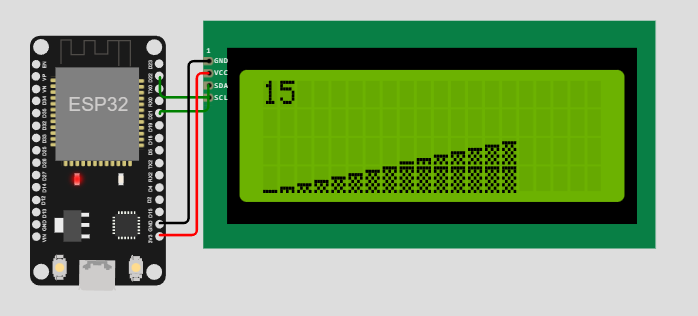

# LcdGraph

Arduino/ESP32 Bar graph library uses custom charactors to draw bar graphs on
LCD displays.



## How to use

### Setup

Copy [LcdGraph.cpp](LcdGraph.cpp) and [LcdGraph.h](LcdGraph.h) into your project.

To use non a I2C LCD remove
```#define USE_I2C```
from the [LcdGraph.h](LcdGraph.h) header file.

Include the header file
```cpp
#include "LcdGraph.h"
```
### Init

Create an instance of LcdGraph

Call ```init()``` to set number of columns and rows as well as the start column and row.

Call ```createChars()``` to set the LCD display's custom charactors

### Output

Call ```addValue()``` to add a value to the graph

Call ```drawGraph()``` to update the LCD display with the updated graph values

## Example

Try it out in the Wokwi online [ESP32 simulator](https://wokwi.com/projects/358930804474816513)
